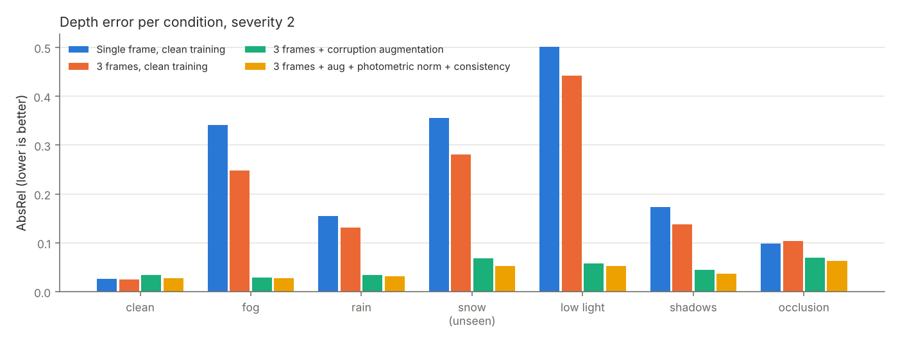
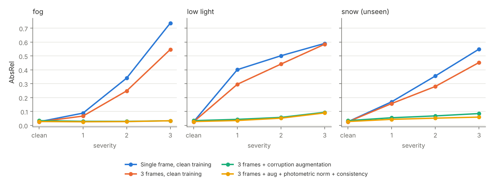
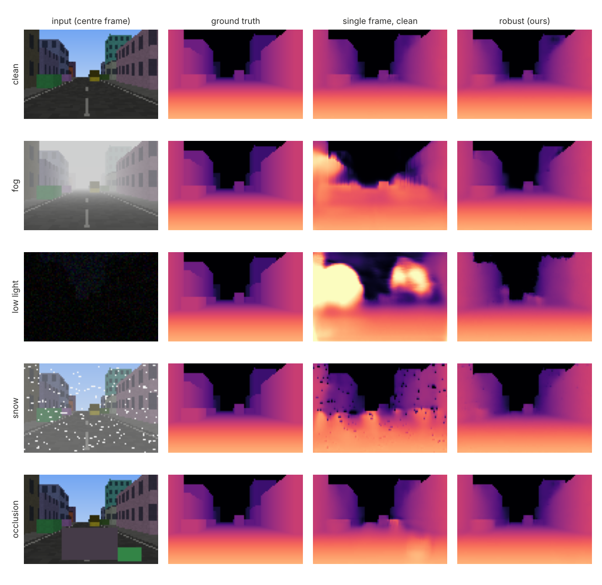

# Robust Feed-Forward Depth and 3D Reconstruction for Dynamic Scenes

A feed-forward network takes a short monocular image sequence and predicts dense metric depth in one pass, without per-scene optimisation. The depth is lifted to a 3D point cloud and a bird's-eye-view (BEV) occupancy grid. This repository asks one question: **what happens to that reconstruction under fog, rain, snow, low light, moving shadows and occlusion, and what makes it hold up?**

Everything is measured against exact ground truth: dense depth, camera poses, moving-object masks and semantic labels from a procedural driving-scene generator. Each method is trained with two seeds, and snow is held out of training to test a condition the model has never seen.



## Results at a glance

All numbers are means over two training seeds and 150 test sequences that share no scenes with training. Severity 2 is a medium setting for every corruption.

- **Reconstruction error fell from 0.271 to 0.044 AbsRel (84 % lower)** averaged over the six corruptions, comparing a single-frame model trained on clean images with the full method.
- **The 3D geometry held up too:** Chamfer distance to the true point cloud dropped from 0.79 m to 0.30 m, and BEV occupancy IoU doubled from 0.15 to 0.30.
- **Snow was never seen in training.** On snow, the full method reached 0.052 AbsRel against 0.068 for augmentation alone (24 % lower). At the highest severity the gap widens to 0.060 vs 0.085.
- **Moving objects benefit most** from photometric normalisation and the consistency loss: 0.148 vs 0.179 AbsRel on moving pixels.
- **Augmentation has a price on clean images** (AbsRel 0.026 rose to 0.034). The consistency loss brings most of that back (0.028).
- **Predictions became temporally consistent.** After warping one frame's depth into the next with the true camera motion, the disagreement on static scene points fell from 16.6 % to 3.2 %.
- **Occlusion is the hardest case and the least improved** (0.099 to 0.063). The network cannot see behind a fixed occluder, and three frames rarely reveal what is behind it.

## What is compared

| Variant | Input | Training data | Extra |
|---|---|---|---|
| `single_clean` | 1 frame | clean | none |
| `multi_clean` | 3 frames (t-1, t, t+1) | clean | none |
| `multi_aug` | 3 frames | 75 % corrupted (fog, rain, low light, shadows, occlusion; severity 1-3) | none |
| `robust` | 3 frames | same as `multi_aug` | photometric normalisation + clean/corrupted consistency loss |

**Photometric normalisation** standardises each input frame per channel before the network sees it. This removes global exposure and contrast, the things low light, fog and exposure changes mostly alter.

**Consistency loss.** The same window goes through the network twice, once clean and once corrupted. The corrupted prediction is pulled towards the clean one, with the gradient stopped on the clean branch: `L = L_depth(corrupted) + L_depth(clean) + 0.5 * |log d_corrupted - stopgrad(log d_clean)|`. The network learns to give the same geometry whatever the weather, instead of only fitting each corrupted image to its label.

All variants share one U-Net (about 0.51 M parameters, GroupNorm, SiLU). Frames are fused early along the channel axis, and two normalised pixel-coordinate channels act as a geometric prior. The network predicts log-depth between 1 m and 80 m. Training uses L1 on log-depth plus a gradient-matching term, AdamW with a one-cycle schedule, and 15 epochs over 2,400 windows.

## Full results

### AbsRel by condition (severity 2, lower is better)

| Method | clean | fog | rain | snow (unseen) | low light | shadows | occlusion | Mean corrupted |
|---|---|---|---|---|---|---|---|---|
| Single frame, clean training | 0.026 | 0.341 | 0.154 | 0.356 | 0.502 | 0.173 | 0.099 | 0.271 |
| 3 frames, clean training | 0.026 | 0.248 | 0.131 | 0.280 | 0.442 | 0.138 | 0.103 | 0.224 |
| 3 frames + corruption augmentation | 0.034 | 0.029 | 0.034 | 0.068 | 0.057 | 0.045 | 0.069 | 0.050 |
| 3 frames + aug + photometric norm + consistency | 0.028 | 0.027 | 0.032 | 0.052 | 0.052 | 0.036 | 0.063 | 0.044 |

At severity 2, `robust` beats `multi_aug` for both seeds on every condition, and the largest seed-to-seed spread for these two methods is ±0.002. Across all severities, the one exception is fog at severity 3 for seed 1, where the two are equal within noise.

### All metrics, averaged over the six corruptions

| Method | AbsRel | RMSE (m) | δ<1.25 | AbsRel moving objects | Temporal inconsistency | Chamfer (m) | BEV occupancy IoU |
|---|---|---|---|---|---|---|---|
| Single frame, clean training | 0.271 | 8.74 | 0.710 | 0.769 | 0.166 | 0.794 | 0.152 |
| 3 frames, clean training | 0.224 | 7.72 | 0.761 | 0.726 | 0.136 | 0.710 | 0.164 |
| 3 frames + corruption augmentation | 0.050 | 2.48 | 0.962 | 0.179 | 0.033 | 0.322 | 0.288 |
| 3 frames + aug + photometric norm + consistency | 0.044 | 2.34 | 0.969 | 0.148 | 0.032 | 0.303 | 0.303 |

### Severity sweep



Models trained on clean data degrade steeply with fog density and darkness. Both augmented models stay flat on fog. On unseen snow, the consistency-trained model degrades more slowly than augmentation alone. The full sweep is in [`results/results.md`](results/results.md).

### Examples



Each row shows the centre frame, ground-truth depth, the clean-trained single-frame model and the full method. In fog, low light and snow, the clean-trained model mistakes haze, darkness and flakes for geometry, while the full method keeps the street layout.

## Data and corruptions

`scenes.py` ray-casts streets with buildings, parked cars, and vehicles and pedestrians moving independently of the ego camera. The camera drives forward with slight yaw and lateral drift. For each frame the generator stores RGB, z-depth, semantic labels (sky, road, static, dynamic) and the camera-to-world pose. Rendering is analytic, so the ground truth is exact and fully reproducible from a seed.

`corruptions.py` applies corruptions to the whole sequence so they stay coherent over time, as in a real video:

| Corruption | Model |
|---|---|
| fog | Koschmieder scattering `I = J t + A (1 - t)`, `t = exp(-beta d)` with the true depth |
| rain | light attenuation plus slanted streaks re-sampled every frame |
| snow (held out) | haze plus flakes of two sizes, re-sampled every frame |
| low light | darkening with gamma, signal-dependent shot noise and read noise |
| shadows | low-frequency shadow field drifting over time plus per-frame exposure changes |
| occlusion | a long-term occluder fixed in the image (e.g. dirt on the lens housing) plus short-lived occluders |

## Metrics

- **AbsRel, RMSE, δ<1.25**: standard depth metrics on every pixel with ground-truth depth (sky excluded).
- **AbsRel on moving objects**: the same, restricted to pixels of independently moving vehicles and pedestrians.
- **Temporal inconsistency**: frame t's predicted depth is warped into frame t+1 with the true relative pose and compared with the prediction at t+1. Static pixels only, and only where warping the ground truth confirms the point is visible in both frames, so disocclusions are not counted.
- **Chamfer distance**: symmetric mean nearest-neighbour distance between predicted and true point clouds within 40 m.
- **BEV occupancy IoU**: obstacle points (more than 0.3 m above the road) on a 1 m grid covering 20 m × 30 m in front of the car. A finer 0.5 m grid out to 40 m proved too strict: a uniform 3 % depth error on ground truth alone drops its IoU to about 0.2, so it measured pixel quantisation more than geometry.

A geometry-only baseline (every pixel below the horizon lies on a flat road) is also evaluated and kept in `results/metrics_raw.json`. It is exact on the road but cannot place buildings or vehicles, so its AbsRel (about 2.1) is left out of the tables.

## Limitations

- **Synthetic data only.** The scenes are simple boxes at 64×96 pixels. Real driving data adds textureless regions, reflections and sensor artefacts. The pipeline is written so a real dataset loader (images, depth, poses) can replace `build_split`.
- **Camera poses are not estimated.** True poses are used only to measure temporal consistency. The network itself gets no pose input.
- **Early fusion over three frames is a simple multi-view design.** Attention-based multi-view backbones would be the natural next step. NeRF and 3D Gaussian Splatting are not used here.
- **Reflections and night-time headlights are not modelled.**
- **The BEV occupancy is geometric (occupied or free), not semantic.** Semantic occupancy and 4D occupancy forecasting would need a semantic head and future-frame targets.

## Reproduce

```bash
pip install torch --index-url https://download.pytorch.org/whl/cpu
pip install -e ".[dev]"
pytest -q                      # 57 tests
bash scripts/run_all.sh        # train 4 variants x 2 seeds, evaluate, write results/
```

Each run takes 14-30 minutes on two CPU cores. Docker: `docker build -t robustrecon . && docker run robustrecon`.

## Layout

```
configs/default.yaml        scene, training and evaluation settings
src/robustrecon/scenes.py       procedural dynamic scenes with exact ground truth
src/robustrecon/corruptions.py  fog, rain, snow, low light, shadows, occlusion
src/robustrecon/model.py        multi-frame U-Net, photometric normalisation, loss
src/robustrecon/geometry.py     back-projection, reprojection consistency, Chamfer, BEV occupancy
src/robustrecon/train.py        training from the YAML config
src/robustrecon/evaluate.py     evaluation of every variant under every condition
src/robustrecon/report.py       tables and figures in results/
tests/                          57 tests covering geometry, corruptions, metrics, data and model
```

## License

MIT
